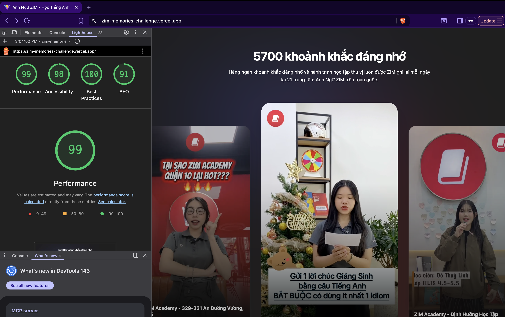

# 🎥 Zim Memories Challenge - High-Performance Video Slider

## 🚀 Giải pháp Kỹ thuật & Hiệu ứng

### 1. Video Streaming (HLS.js)

Dự án sử dụng giao thức **HLS (HTTP Live Streaming)** thay vì file MP4 truyền thống.

## 🎯 Lý do chọn hiệu ứng

- Hiệu ứng scale + fade giúp card nổi bật khi được chú ý.
- Tự động phát video khi tương tác giúp tăng engagement so với nút play thủ công.
- Motion, Hover mới load video giúp tiết kiệm tài nguyên hơn preload hàng loạt.

> Mục tiêu chính: **focus vào trải nghiệm video nhanh, trực quan, trực tiếp. Tự động chia nhỏ video giúp giảm thời gian phản hồi đầu tiên (FCP), tiết kiệm băng thông và đảm bảo video phát mượt mà ngay cả trên đường truyền yếu.**.

### 2. Tối ưu hóa UI/UX & Motion

- **Hardware Acceleration:** Sử dụng `framer-motion` kết hợp với `will-change: transform` và `translateZ(0)` để kích hoạt GPU, đảm bảo các hiệu ứng Hover/Scale luôn đạt mức 60fps ổn định.
- **Static Bottom Overlay:** Một lớp phủ Gradient đen mờ được cố định phía dưới (`z-20`).
- **Mục đích:** Giữ độ tương phản ổn định cho văn bản, giúp tiêu đề và mô tả luôn dễ đọc trên mọi nền video mà không làm mờ/đục toàn bộ khung hình video phía trên.

---

## Accessibility

- aria-label nút Play/Mute
- aria-expanded mô tả
- focus ring hỗ trợ keyboard
- có thể thêm `prefers-reduced-motion`

## Tối ưu hiệu năng

✔ React.memo tránh re-render  
✔ video chỉ phát khi active  
✔ thumbnail lazy load  
✔ HLS tách bằng hook

## 📊 Kết quả Lighthouse

| Performance | Accessibility | Best Practices | SEO    |
| ----------- | ------------- | -------------- | ------ |
| **99**      | **98**        | **100**        | **91** |



---

## 3. 🛠 Hướng dẫn Khởi chạy Dự án

npm

Dự án sử dụng stack công nghệ: **Vite + React 19 + Tailwind CSS v4**.

### 1. Cài đặt môi trường

Đảm bảo đã cài đặt Node.js (phiên bản 18 trở lên), sau đó chạy lệnh:

```bash
npm install
npm run dev
open: http://localhost:5173/
```
